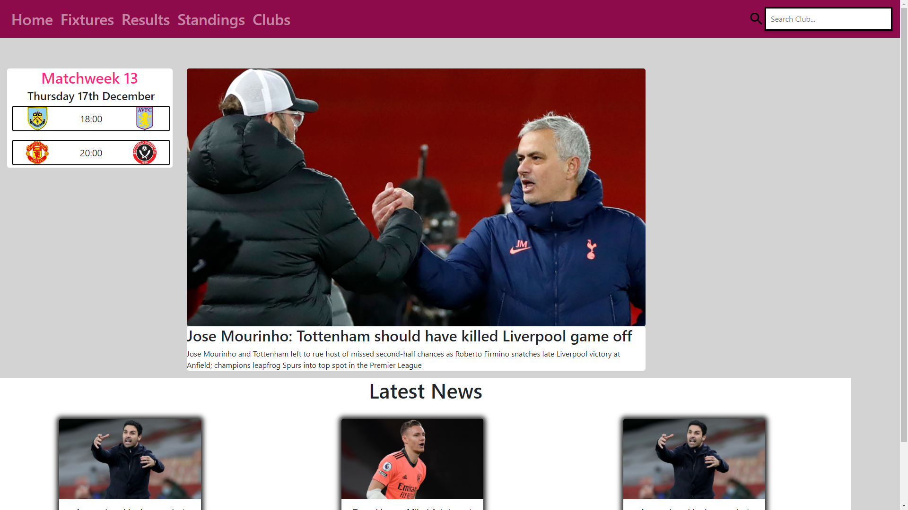
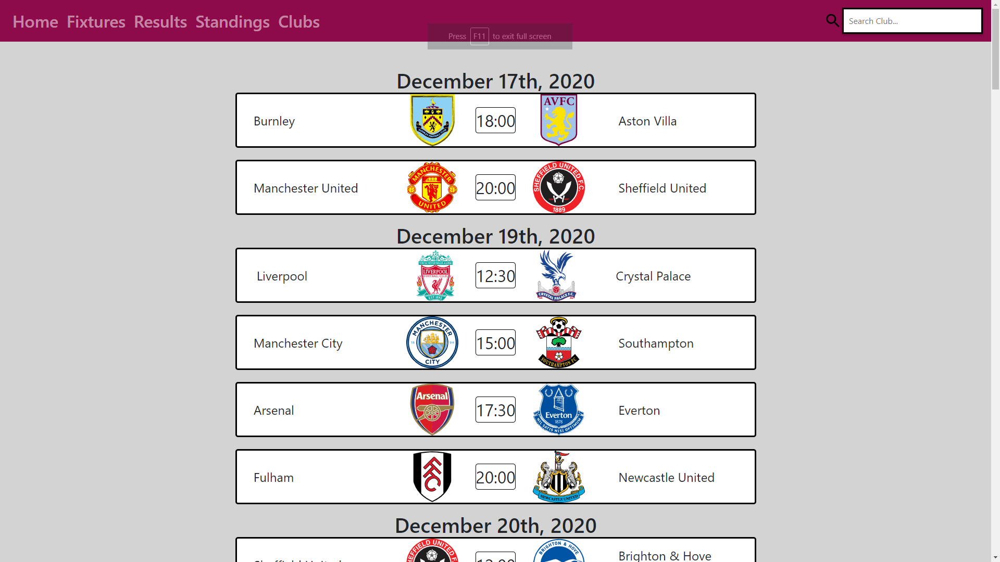
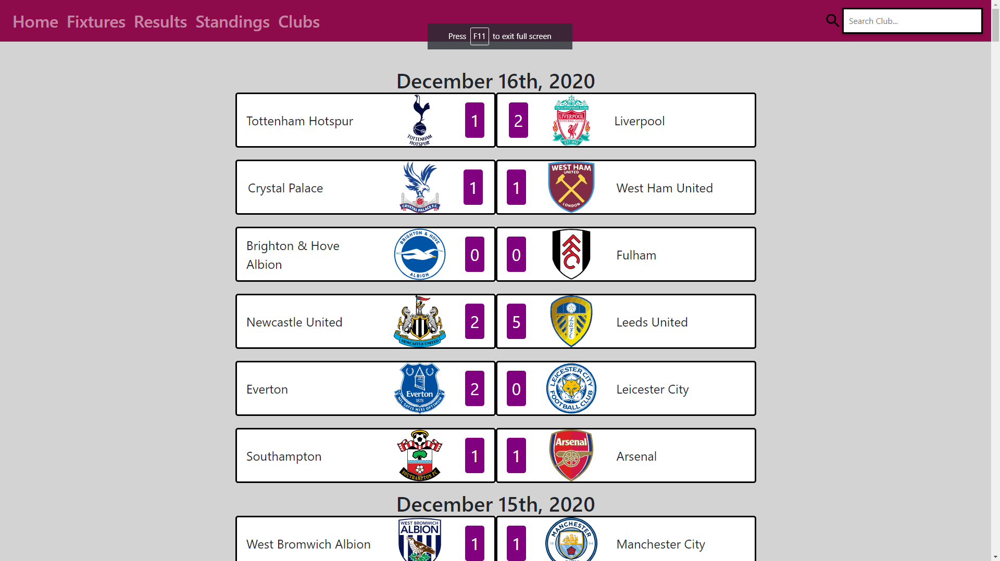
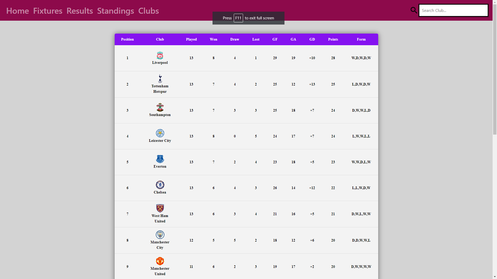
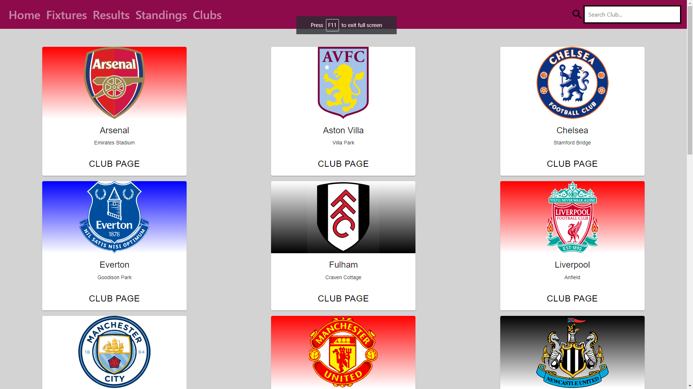

# Premier League Site

An React-based project that shows information for the current Premier League season (Standings, Fixtures, Results, Clubs, Live Games, Matchweek games)

## Dependencies/Libraries Used

- <a href="https://react-bootstrap.github.io/">React Bootstrap</a>: Needed for creating the navigation bar
- <a href="https://jquery.com/">jQuery</a>: Needed for making ajax api calls to football-data.org
- <a href="https://momentjs.com/">Moment</a>: Needed for formatting the time to be more eligible to read
- <a href="https://reactrouter.com/">React Router</a>: Needed for creating multiple pages for navigating the site

## API Reference

- <a href="https://www.football-data.org/">Football-data.org</a>: Used for getting (Standings, Fixtures, Results, Clubs) for the Premier League
- <a href="https://gnews.io/">GNews</a>: Used for getting the latest news on the Premier League in England

## Screenshots
  

  

 

